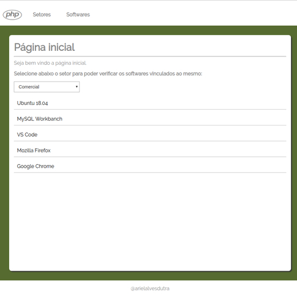

# Objetivo do repositório

Praticar Laravel 5.8.

#### Sobre o sistema

Principais funcionalidades:

- Cadastrar setores
- Cadastrar softwares 
- Vincular softwares aos setores

#### Tela do sistema:



# Instalação

1 - Composer install:

```bash
$ composer install
```

2 - Criar um banco de dados MySQL e inserir as configurações no arquivo `.env`.

** obs: aplicação foi desenvolvida com MySQL 5.7. Utilizando MySQL 8.0 resultou em erros no Laravel.

** obs2: o arquivo `docker/docker-compose.yml` foi utilizado para o servidor MySQL.

3 - Ambiente PHP: a aplicaçao foi desenvolvida com PHP 7.3. Utilizar uma versão anterior pode resultar em incompatibilidade.

4 - Executar as migrations:

```bash
$ php artisan migrate
```

5 - Executar o servidor:

```bash
$ php artisan serve
```
 